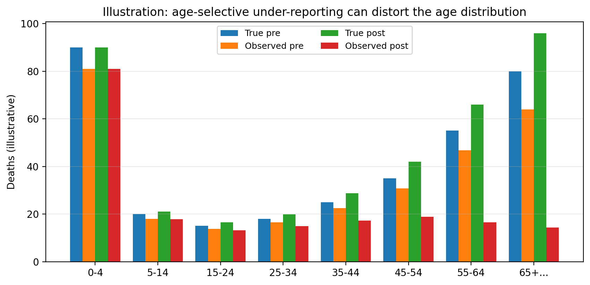

```{r setup, include=FALSE}
knitr::opts_chunk$set(
  collapse = TRUE,
  comment = "#>",
  message = FALSE,
  warning = FALSE
)
```

## Why the age distribution is informative

In the motivating setting for `vrcmort`, the observed VR data show a sharp pattern after conflict starts:

- trauma deaths increase (as expected),
- non-trauma deaths decrease (implausibly), and
- the age distribution of non-trauma deaths shifts younger.

If you believe the underlying non-trauma mortality burden among older adults has not collapsed overnight, this is strong evidence that *registration completeness has become age-selective*.

This vignette explains how `vrcmort` uses age structure to model under-reporting.

## An illustration

The plot below is a stylised illustration of the pattern the model is designed to capture.

```{r, echo=FALSE, out.width='100%'}

```

Pre-conflict, observed deaths roughly track true deaths in all age groups. Post-conflict, observed deaths fall steeply in older ages even if the true age profile remains similar.

## What vrcmort does in the base model

In the base model, reporting completeness is modelled on the logit scale:

\[
\text{logit}(\rho_{r,t,a,s,g}) = \kappa_{0,g} + \kappa_{post,g} \cdot \text{post}_t + \ldots + \text{agepen}(a,g,t).
\]

The **age penalty** is designed to be:

- non-negative,
- monotone non-decreasing with age, and
- only active after conflict begins.

A conceptual form is:

\[
\text{agepen}(a,g,t) = -\delta_a \cdot \mathbb{1}[g=\text{non-trauma}] \cdot \text{post}_t,
\]

with \(\delta_a \ge 0\) and \(\delta_a\) increasing with age group.

### Why monotone?

Monotonicity encodes a weak structural belief: if the system collapses in a way that removes older deaths, it is unlikely to remove age 65+ deaths while still reliably recording age 45-54 deaths.

It also stabilises inference by preventing the model from fitting a highly wiggly age pattern in completeness.

### How the monotone penalty is implemented

In Stan, monotonicity is implemented via positive increments between successive age groups:

\[
\delta_1 = 0, \quad \delta_{a+1} = \delta_a + \Delta_a, \quad \Delta_a \ge 0.
\]

The increments \(\Delta_a\) have priors that control how steep the penalty can become.

## Practical data preparation advice

### Choose age groups with a clear interpretation

Use age groups that reflect both epidemiology and data density.

A common starting point is 5-year or 10-year bins up to a final open-ended group (for example 65+).

If older ages are very sparse even pre-conflict, consider coarser bins at older ages.

### Avoid changing age group definitions across time

If you redefine age groups over time, the model will interpret changes in the age distribution as a change in mortality or completeness.

### Keep the denominator consistent

Because the expected count depends on exposure

\[
\mu = E \cdot \lambda \cdot \rho,
\]

large errors in the age-specific exposure can mimic reporting collapse.

If you have displacement flows, try to apply them to the age-sex population structure so that the exposure reflects the people actually at risk in each region-month.

## Diagnosing age-selective under-reporting in data

`vrc_diagnose_reporting()` provides basic summaries, but for age-specific work you will often want a focused plot.

Here is a template (pseudo-code) for plotting age distributions by period and cause.

```{r, eval=FALSE}
library(dplyr)
library(ggplot2)

vr_long %>%
  mutate(period = if_else(time < t0, "pre", "post")) %>%
  group_by(period, age, cause) %>%
  summarise(y = sum(y, na.rm = TRUE), .groups = "drop") %>%
  group_by(period, cause) %>%
  mutate(frac = y / sum(y)) %>%
  ggplot(aes(x = age, y = frac, group = period)) +
  geom_line() +
  facet_wrap(~ cause) +
  labs(y = "Share of recorded deaths")
```

The key pattern to look for is a post-conflict shift of non-trauma deaths towards younger ages.

## Inspecting inferred completeness by age

After fitting, you can extract the inferred completeness surface and aggregate it by age.

```{r, eval=FALSE}
fit <- vrcm(
  mortality = vrc_mortality(~ 1),
  reporting = vrc_reporting(~ 1),
  data = vr_long,
  t0 = t0,
  chains = 4,
  iter = 1000
)

rho <- posterior_reporting(fit)

# Summarise completeness by age and period
rho %>%
  mutate(period = if_else(time < t0, "pre", "post")) %>%
  group_by(period, cause, age) %>%
  summarise(rho_mean = mean(rho_mean), .groups = "drop")
```

If the model is behaving as intended, you should see a larger post-conflict drop in inferred completeness for older ages in the non-trauma cause group.

## Limitations and extensions

Age structure is informative, but it is not magic.

- If conflict truly changes the age distribution of non-trauma deaths (for example because older adults leave the region, or because access to care changes differentially by age), you need population and covariates to reflect that.
- If there is systematic misclassification (for example non-trauma deaths being coded as trauma, or as ill-defined), a misclassification extension may be needed.

The current base model is designed as a starting point that you can stress test and extend.
